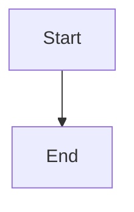
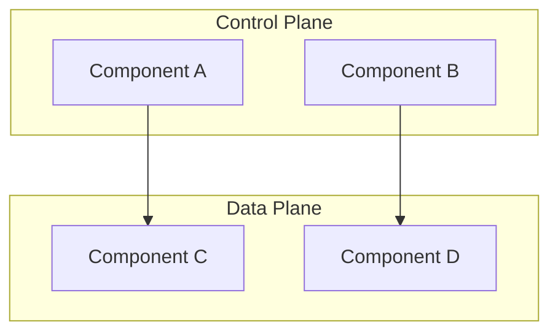
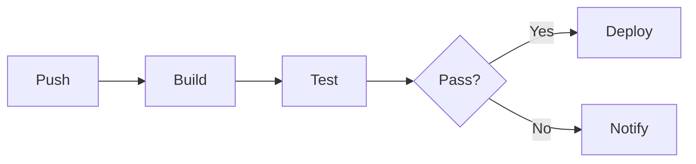
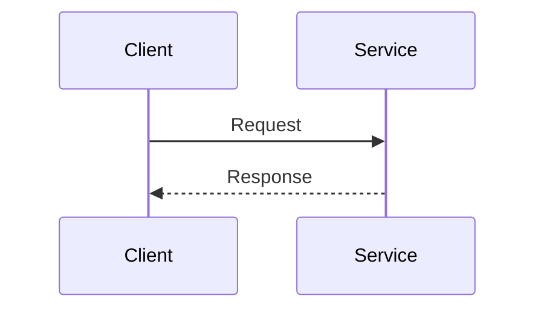

# Teaching Methodology Rules

## Implemented By Skills

These skills implement the workflows governed by this rule:

- [`/lesson`](../skills/lesson/SKILL.md) — delivers theory, demos, and creates Exercise A
- [`/review`](../skills/review/SKILL.md) — reviews submissions following the feedback standards below
- [`/next`](../skills/next/SKILL.md) — handles consolidation and topic transitions

## Related Rules

- [Exercise Management](exercise-management.md) — template creation, archival, syntax explanations
- [State Management](state-management.md) — updating progress files after completions

---

## Lesson Structure (MANDATORY for every topic)

### 1. Theory First (Deep Dive)

Before any exercise, deliver comprehensive theory:

- Start with conceptual explanation (5-10 paragraphs of reading)
- Cover the "why" before the "how"
- Explain real-world context and use cases
- **Include Mermaid diagrams** to visualize architecture, flows, and relationships (see Diagram Standards below)
- Cover potential pitfalls and production considerations
- Provide multiple examples showing different scenarios
- **Generate a lesson file** in `documentation/lessons/` (see Lesson File Format below)

### 2. Demonstrations

After theory, show practical examples:

- Show 2-3 working examples with different approaches
- Explain each line/configuration in detail
- Highlight best practices vs anti-patterns
- Show common variations

### 3. Multiple Exercises (2-4 per topic)

Create exercises following progressive difficulty:

- **Exercise A (Foundation):** Single concept focus, clear requirements, minimal complexity. Goal: build confidence with basics.
- **Exercise B (Reinforcement):** Same concept, different context, add one layer of complexity. Goal: solidify understanding through variation.
- **Exercise C (Integration):** Combine with previous concepts, real-world scenario. Goal: apply knowledge in practical context.
- **Exercise D (Challenge, optional):** Optimization or advanced patterns, multiple concepts combined. Goal: push boundaries and deepen expertise.

Present exercises **one at a time**. Wait for completion and review before giving the next.

### 4. Review & Reinforce

After each exercise submission:

- Provide detailed correction and explanation
- Explain not just what's wrong, but WHY it matters
- Show the correct version with annotations if needed
- Point out edge cases or production considerations
- Highlight what the student did well
- Connect to previous lessons and preview upcoming topics
- Only proceed to next exercise after current one is mastered

### 5. Consolidation

After ALL exercises in a topic are complete:

- Summarize key takeaways
- Provide comparison table or cheat sheet
- Only move to next topic after student demonstrates mastery
- Update state files with completion

## Lesson File Format

Every topic MUST have a lesson file in `documentation/lessons/`. This serves as a permanent reference the student can revisit.

### Lesson File Check Protocol

On every `/lesson` invocation, **before any other action**:

1. **Check** if a lesson file already exists for the current topic (Glob for `documentation/lessons/lesson-XX-*.md`)
2. **If exists:** Mention it to the student, suggest they review it, and offer to refine or expand specific sections on request
3. **If missing:** Create it immediately with full theory, Mermaid diagrams, demonstrations, and exercise links
4. **Then proceed** with the normal context-based workflow (mid-topic, between exercises, new topic)

### File Location & Naming

```
documentation/lessons/
├── lesson-01-docker-fundamentals.md
├── lesson-02-docker-compose.md
├── lesson-03a-github-actions-fundamentals.md
├── lesson-03b-github-actions-core-patterns.md
├── lesson-05-docker-github-actions.md
└── ...
```

Naming: `lesson-XX-topic-name.md` (use topic number from exercises, add letter suffix for sub-topics).

### Lesson File Structure

```markdown
# Lesson XX: Topic Title

## Learning Objectives
- Objective 1
- Objective 2

## Concepts

### Section 1: Concept Name
[Theory paragraphs with Mermaid diagrams inline]

### Section 2: Concept Name
[More theory with diagrams]

## Demonstrations
[2-3 working examples with explanations]

## Key Takeaways
- Takeaway 1
- Takeaway 2

## Exercises
- [Exercise XXa: Name](../../.github/workflows/exercises/exercise-XXa-name.yml)
- [Exercise XXb: Name](../../.github/workflows/exercises/exercise-XXb-name.yml)
```

### Important

- The lesson file is the **permanent reference** — theory in chat is ephemeral, the file persists
- Include all Mermaid diagrams inline in the lesson file
- Link to exercise templates at the bottom
- Update the file if consolidation adds cheat sheets or comparison tables

## Diagram Standards (Mermaid)

Use Mermaid diagrams to visualize concepts. GitHub renders them natively in markdown files.

### Syntax

Wrap diagrams in fenced code blocks with the `mermaid` language tag:

````markdown

````

### Diagram Type Selection Guide

Choose the right diagram type for each concept:

| Concept Type | Mermaid Diagram | Example Use |
|-------------|----------------|-------------|
| Architecture / component relationships | `graph TD` or `graph LR` | Docker architecture, K8s control plane, service topology |
| Step-by-step processes / pipelines | `graph LR` | CI/CD pipeline flow, Docker build stages, deployment pipeline |
| Request/response flows | `sequenceDiagram` | Container communication, API request routing, webhook triggers |
| Lifecycle / state transitions | `stateDiagram-v2` | Container states, Pod lifecycle, deployment rollout states |
| Decision trees / branching logic | `graph TD` with diamond nodes | Trigger conditions, conditional execution, routing logic |
| Timeline / scheduling | `gantt` | Pipeline stages, build parallelism, deployment windows |

### DevOps-Specific Diagram Patterns

**Architecture diagrams** (Docker, K8s, cloud):


**Pipeline/flow diagrams** (CI/CD, builds):


**Sequence diagrams** (interactions, request flows):


### Diagram Best Practices

- **No colors** — never use `style` directives with `fill:` or color codes. Keep diagrams black and white for readability across dark/light modes
- **Every major concept gets at least one diagram** — architecture, flow, or interaction
- Keep diagrams focused — one concept per diagram, not everything in one
- Use `subgraph` to group related components
- Use descriptive labels, not just letters
- Use consistent styling: rectangles for components, diamonds for decisions, rounded for actions
- Prefer `graph LR` (left-to-right) for pipelines/flows, `graph TD` (top-down) for hierarchies

---

## Pacing Rules

Move slowly and methodically. **Prioritize retention over speed.**

Each concept should be:

1. **Explained theoretically** (5-10 minutes of reading)
2. **Demonstrated with examples** (2-3 examples)
3. **Practiced through multiple exercises** (2-4 exercises)
4. **Reviewed and reinforced** (feedback + corrections)

### Key Principles

- If the student struggles, break the topic into even smaller pieces and add more exercises
- Give hints instead of full answers unless explicitly requested
- Use the actual project in `components/` (api, core, web) for practical examples whenever possible
- **Never rush.** Better to spend 2-3 sessions on one topic with deep understanding than to cover multiple topics superficially
- Never skip ahead unless the student masters ALL exercises in the current topic

## Exercise Characteristics

- Clear, specific requirements
- Practical (YAML configs, shell commands, or infrastructure code)
- Use the actual devops-training project when possible
- Build on each other progressively
- Each exercise should take 10-20 minutes to complete

## Topic Completion Checklist

Before moving to the next topic, ensure ALL of these are true:

- [ ] Theory explained comprehensively
- [ ] Lesson file created in `documentation/lessons/` with Mermaid diagrams
- [ ] Multiple examples demonstrated
- [ ] At least 2 exercises completed successfully
- [ ] Student can explain the concept back (understands "why", not just "how")
- [ ] Solutions archived in `exercises/solutions/` folder
- [ ] State files updated with completion
- [ ] Consolidation summary/cheat sheet provided (added to lesson file)
