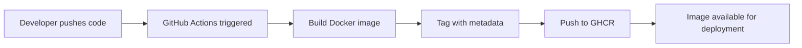
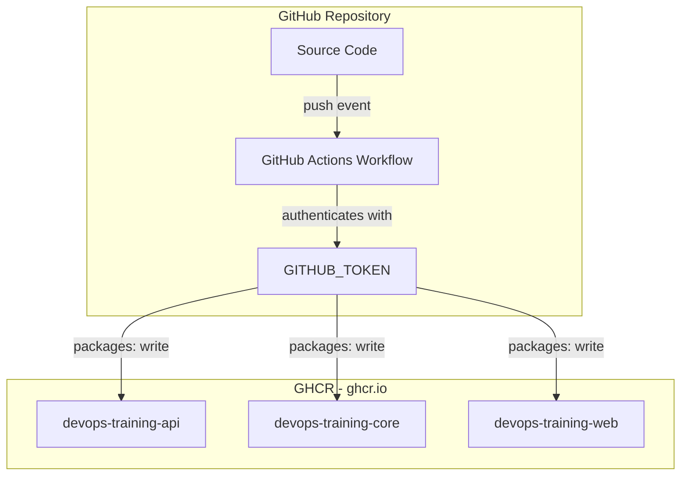
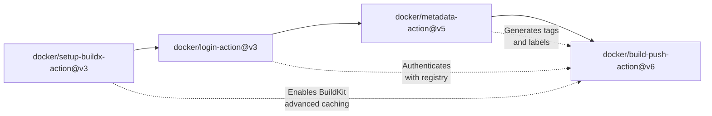
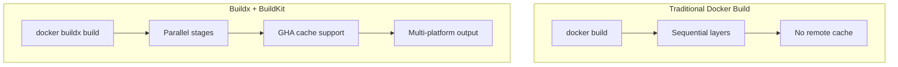
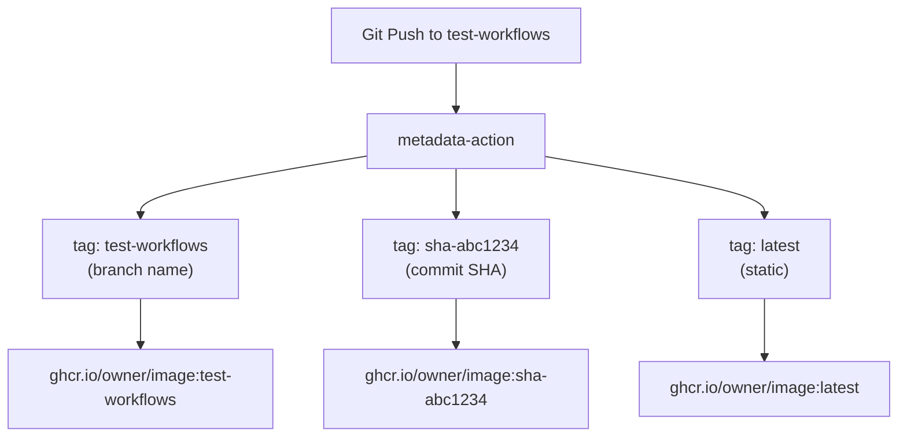
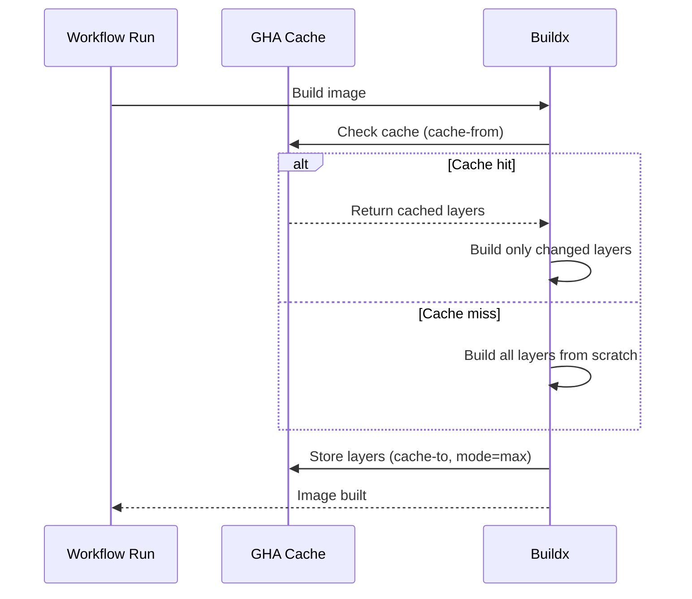
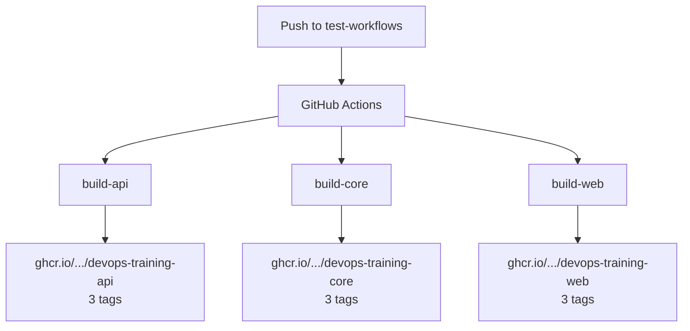

# Lesson 05: Building and Pushing Docker Images with GitHub Actions

## Learning Objectives

- Understand how Docker and GitHub Actions integrate for automated CI/CD
- Authenticate with GitHub Container Registry (GHCR) using `GITHUB_TOKEN`
- Use Docker Buildx for advanced building capabilities
- Implement multiple tagging strategies with `docker/metadata-action`
- Build multiple services in parallel using separate jobs
- Optimize build times with GitHub Actions cache (`type=gha`)

---

## Concepts

### 1. Why Docker + GitHub Actions?

In production, you never build Docker images manually on your laptop and push them. Instead, a CI/CD pipeline handles building, tagging, and pushing images automatically every time code changes. This ensures:

- **Reproducibility** — every build happens in a clean environment
- **Traceability** — every image is tagged with the commit that produced it
- **Automation** — no human intervention, no forgotten steps
- **Security** — credentials never leave the CI environment



### 2. GitHub Container Registry (GHCR)

GHCR is GitHub's built-in Docker registry. Every GitHub repository can store Docker images at `ghcr.io`.

**Key characteristics:**
- **URL:** `ghcr.io/<owner>/<image-name>:<tag>`
- **Authentication:** Uses `GITHUB_TOKEN` (auto-generated per workflow run)
- **Permissions:** Requires `packages: write` in the workflow
- **Visibility:** Tied to the repository — images inherit repo visibility
- **Naming:** Registry requires **lowercase** owner names



### 3. The Docker Actions Ecosystem

GitHub provides four official Docker actions that work together as a pipeline:



| Action | Purpose | Key Inputs |
|--------|---------|------------|
| `docker/setup-buildx-action@v3` | Enables Docker BuildKit with advanced caching | (none required) |
| `docker/login-action@v3` | Authenticates with a container registry | `registry`, `username`, `password` |
| `docker/metadata-action@v5` | Generates tags and OCI labels from Git metadata | `images`, `tags` |
| `docker/build-push-action@v6` | Builds and pushes the Docker image | `context`, `file`, `push`, `tags`, `labels`, `cache-from`, `cache-to` |

### 4. Docker Buildx and BuildKit

Buildx is the next-generation Docker build system built on BuildKit. It provides:

- **Layer caching** — reuse unchanged layers across builds
- **Multi-platform builds** — build for linux/amd64, linux/arm64, etc.
- **Build secrets** — pass secrets without embedding in the image
- **Parallel stage execution** — multi-stage builds run faster



### 5. Tagging Strategies

Images need meaningful tags so you can identify which code produced which image. The `docker/metadata-action` automates this.

#### Tag Types

| Type | Syntax | Example Output | Use Case |
|------|--------|---------------|----------|
| Branch | `type=ref,event=branch` | `test-workflows` | Know which branch built it |
| SHA | `type=sha,prefix=sha-` | `sha-abc1234` | Trace back to exact commit |
| Latest | `type=raw,value=latest,priority=200` | `latest` | Convenience pull without version |
| Semver | `type=semver,pattern={{version}}` | `1.2.3` | Release versioning |



#### Step Outputs

The metadata action produces outputs that you pass to the build-push step:

```yaml
- name: Extract metadata
  id: metadata              # <-- step ID
  uses: docker/metadata-action@v5
  with:
    images: ghcr.io/${{ env.OWNER_LC }}/devops-training
    tags: |
      type=ref,event=branch
      type=sha,prefix=sha-
      type=raw,value=latest,priority=200

- name: Build and push
  uses: docker/build-push-action@v6
  with:
    tags: ${{ steps.metadata.outputs.tags }}      # <-- reference by step ID
    labels: ${{ steps.metadata.outputs.labels }}
```

The pattern `${{ steps.<id>.outputs.<name> }}` lets you pass data between steps.

### 6. OCI Labels

The metadata action also generates **OCI labels** — metadata embedded directly in the Docker image. These labels include:

- `org.opencontainers.image.source` — link to the GitHub repo
- `org.opencontainers.image.revision` — the Git commit SHA
- `org.opencontainers.image.created` — build timestamp

This makes every image self-documenting — you can inspect it and trace it back to the exact code and time.

### 7. GitHub Actions Cache for Docker

Docker builds can be slow (downloading base images, installing dependencies). GitHub Actions cache (`type=gha`) stores build layers between runs.

```yaml
cache-from: type=gha        # Pull cached layers
cache-to: type=gha,mode=max # Push all layers to cache
```

**`mode=max`** caches all layers (including intermediate), not just the final image. This maximizes cache hits on subsequent builds.



### 8. Lowercase Conversion

GHCR requires **lowercase** image names, but GitHub usernames can be mixed case (e.g., `S.Mabrouk`). The solution is to convert the repository owner to lowercase:

```yaml
- name: Set lowercase owner name
  env:
    OWNER: "${{ github.repository_owner }}"
  run: |
    echo "OWNER_LC=$(echo $OWNER | tr '[:upper:]' '[:lower:]')" >> $GITHUB_ENV
```

This writes `OWNER_LC` to `$GITHUB_ENV`, making it available in all subsequent steps as `${{ env.OWNER_LC }}`.

### 9. Multi-Service Parallel Builds

In a monorepo with multiple services, the production pattern is to build each service as a **separate job**. Jobs at the same level (without `needs` dependencies) run **in parallel** automatically.



**Why separate jobs instead of matrix?**

| Approach | Pros | Cons |
|----------|------|------|
| **Separate jobs** | Each job has its own context, Dockerfile, image name. Clear in Actions UI. | More YAML (repetitive) |
| **Matrix strategy** | Less YAML, DRY | All services must share the same step structure. Harder to customize per-service. |

For Docker builds, **separate jobs** is the production pattern because each service has its own Dockerfile path, build context, image name, and potentially different build args.

---

## Demonstrations

### Demo 1: Basic Single-Service Build (Exercise 5A Pattern)

```yaml
name: Build Web Service
on:
  push:
    branches: [test-workflows]

jobs:
  build-and-push-web:
    runs-on: ubuntu-latest
    permissions:
      contents: read
      packages: write
    steps:
      - uses: actions/checkout@v4
      - uses: docker/setup-buildx-action@v3
      - uses: docker/login-action@v3
        with:
          registry: ghcr.io
          username: ${{ github.actor }}
          password: ${{ secrets.GITHUB_TOKEN }}
      - name: Set lowercase owner
        env:
          OWNER: "${{ github.repository_owner }}"
        run: |
          echo "OWNER_LC=$(echo $OWNER | tr '[:upper:]' '[:lower:]')" >> $GITHUB_ENV
      - uses: docker/build-push-action@v6
        with:
          context: ./components/web
          file: ./components/web/Dockerfile
          push: true
          tags: ghcr.io/${{ env.OWNER_LC }}/devops-training:${{ github.ref_name }}
          cache-from: type=gha
          cache-to: type=gha,mode=max
```

### Demo 2: Advanced Tagging with Metadata Action (Exercise 5B Pattern)

```yaml
      - name: Extract metadata
        id: metadata
        uses: docker/metadata-action@v5
        with:
          images: ghcr.io/${{ env.OWNER_LC }}/devops-training
          tags: |
            type=ref,event=branch
            type=sha,prefix=sha-
            type=raw,value=latest,priority=200
      - uses: docker/build-push-action@v6
        with:
          context: ./components/web
          push: true
          tags: ${{ steps.metadata.outputs.tags }}
          labels: ${{ steps.metadata.outputs.labels }}
```

### Demo 3: Multi-Service Parallel Build (Exercise 5C Pattern)

```yaml
jobs:
  build-api:
    # ... full build steps with:
    #   images: ghcr.io/<owner>/devops-training-api
    #   context: ./components/api

  build-core:
    # ... full build steps with:
    #   images: ghcr.io/<owner>/devops-training-core
    #   context: ./components/core

  build-web:
    # ... full build steps with:
    #   images: ghcr.io/<owner>/devops-training-web
    #   context: ./components/web
```

All three run simultaneously — total time equals the slowest single build, not the sum of all three.

---

## Key Takeaways

1. **Never build Docker images manually** — always automate through CI/CD
2. **GHCR + GITHUB_TOKEN** — free, built-in, no extra credentials needed
3. **Buildx is mandatory** — enables caching, multi-platform, and build secrets
4. **Tag with meaning** — branch name for context, SHA for traceability, latest for convenience
5. **metadata-action automates tagging** — generates tags and OCI labels from Git metadata
6. **Step outputs pass data** — `${{ steps.<id>.outputs.<name> }}` connects steps
7. **GHA cache cuts build time by ~70%** — use `cache-from` and `cache-to` on every build
8. **Lowercase is required** — convert `github.repository_owner` with `tr` for GHCR
9. **Parallel jobs for monorepos** — separate jobs per service, not matrix strategy

---

## Exercises

- [Exercise 5A: Basic Docker Build & Push](../../.github/workflows/exercises/exercise-05a-docker-build-basic.yml) — COMPLETED
- [Exercise 5B: Advanced Tagging Strategies](../../.github/workflows/exercises/exercise-05b-docker-build-tags.yml) — COMPLETED
- [Exercise 5C: Multi-Service Builds](../../.github/workflows/exercises/exercise-05c-docker-multi-service.yml) — IN PROGRESS
- Exercise 5D: Production Patterns — PENDING
